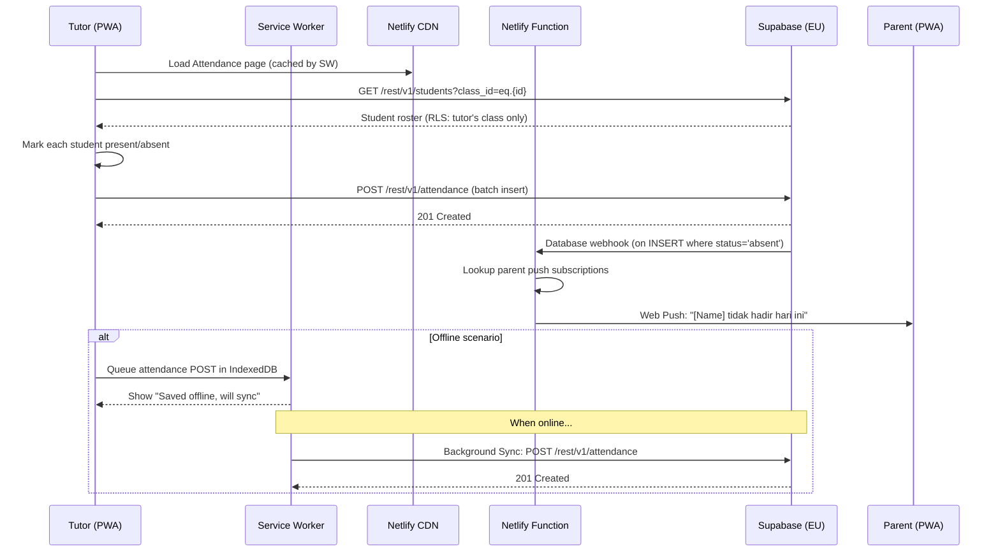
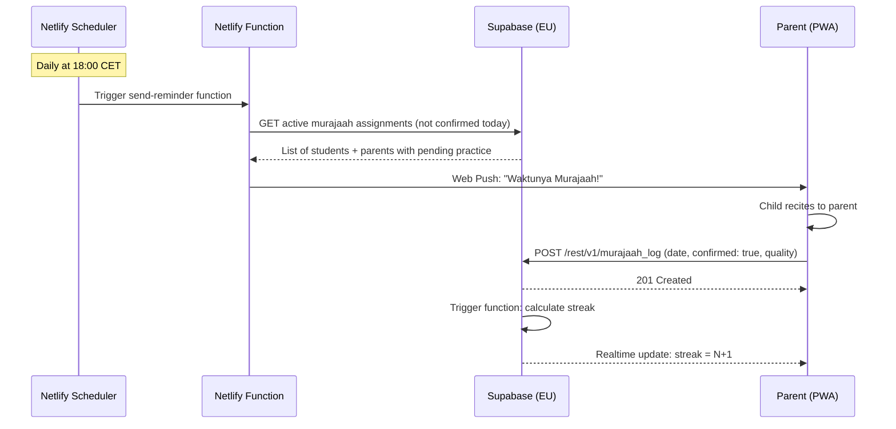
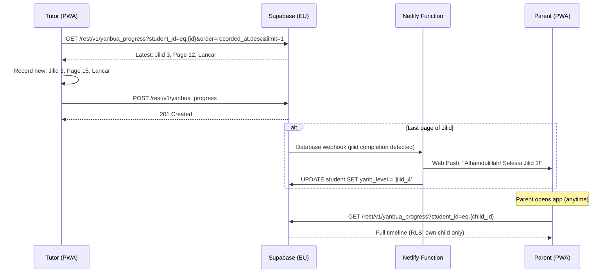

# Technical Architecture Document: PPME - TPA

**Product:** PPME - TPA
**Author:** Solution Architect
**Date:** 2026-06-29
**Status:** Draft
**Related PRD:** PRD-PPME-TPA.md

---

## Table of Contents
- [Requirements Overview](#requirements-overview)
- [Scope](#scope)
- [Assumptions](#assumptions)
- [Dependencies](#dependencies)
- [High-Level Components](#high-level-components)
- [Key Architecture Decisions](#key-architecture-decisions)
- [Impact](#impact)
  - [Domain Model](#domain-model)
  - [API Spec](#api-spec)
  - [Batch Files Spec](#batch-files-spec)
  - [Notification Spec](#notification-spec)
  - [Flows](#flows)
  - [Database](#database)
  - [Billing](#billing)
  - [CS Tools](#cs-tools)
  - [Scheduler](#scheduler)
- [Other Artifacts](#other-artifacts)
- [Questions](#questions)
- [References](#references)

---

# Requirements Overview

Build a Progressive Web App (PWA) for PPME Den Haag's TPA (Taman Penitipan Al-Quran) program that enables:

1. **Attendance Tracking** — Tutors record daily student presence/absence; parents receive notifications and view history
2. **Homework Assignments** — Tutors create and assign homework; parents/students view and track completion
3. **Yanbu'a Progress Tracking** — Record student progression through the 7-jilid Yanbu'a curriculum with mastery assessments
4. **Quran Recitation Tracking** — Track surah/ayah progress with tajweed quality ratings
5. **Murajaah (Memorization) Tracking** — Assign memorization targets, enable parent-confirmed home practice with streaks, tutor assessment

**Key Non-Functional Requirements:**
- GDPR-compliant (EU data residency, encrypted storage, children's data protection)
- Google OAuth 2.0 authentication
- Hosted on Netlify (EU region)
- European technology providers preferred
- Affordable/free-tier cost model suitable for community organization
- Mobile-first PWA with offline support
- Bilingual: Bahasa Indonesia (primary) + Dutch (secondary)

# Scope

### In Scope (Phase 1 — MVP)
* Attendance management (present/absent/late with reasons)
* Yanbu'a progress recording (jilid, page, mastery level)
* Google OAuth 2.0 authentication for all user roles
* Role-based access control (Tutor, Parent, Student, Admin)
* PWA with offline-first capability and background sync
* Netlify deployment (EU region)
* Push notifications for absence alerts

### In Scope (Phase 2)
* Homework assignment module
* Parent dashboard with progress overview
* Quran recitation progress tracking

### In Scope (Phase 3)
* Murajaah home practice with parent confirmation
* Streak tracking and milestone celebrations
* Daily reminder notifications (push + optional WhatsApp)
* Reporting dashboards for TPA Admin

### Out of Scope
* Payment/fee management
* Audio/video recording of recitations
* AI-based tajweed assessment
* Gamification/leaderboards
* Multi-branch PPME deployment (future phase)
* Native mobile apps (iOS/Android app store)

# Assumptions

* All tutors, parents, and students (where applicable) have access to a Google account for authentication
* PPME Den Haag (Medlerstraat 4) has reliable WiFi during TPA sessions
* Parents have smartphones with modern browsers (Android 8+/iOS 13+)
* The standard 7-jilid Yanbu'a curriculum is used universally at PPME
* PPME Den Haag serves up to ~200 students and ~20 tutors maximum
* Tutors are volunteers and not compensated via this platform
* The TPA committee designates an Admin user to manage enrollment data
* The app will be accessed primarily from CET/CEST timezone (Netherlands)
* Netlify free tier or Pro tier ($19/mo) is sufficient for initial traffic volumes
* The PPME board approves use of Google services for member data (per GDPR assessment)

# Dependencies

| Dependency | Provider | Purpose |
|---|---|---|
| Google OAuth 2.0 | Google (Identity Platform) | Authentication for all users — no custom password management |
| Netlify | Netlify Inc. (EU region) | Frontend hosting, CDN, serverless functions, scheduled functions |
| Supabase (EU) | Supabase (Frankfurt region) | PostgreSQL database, Row Level Security, real-time subscriptions, file storage |
| Supabase Auth | Supabase | Google OAuth integration layer, session management |
| Web Push API | Browser-native (VAPID) | Push notifications to subscribed devices |
| WhatsApp Business API | Meta (optional Phase 3) | Reminder notifications via WhatsApp for Murajaah |
| Quran Reference Data | Open-source (quran.com API or static JSON) | 114 Surahs with ayah counts — loaded as seed data |
| Yanbu'a Curriculum Data | Manual seed | 7 Jilid with page counts — pre-loaded reference data |

# High-Level Components

```
┌─────────────────────────────────────────────────────────────────────┐
│                        CLIENT (PWA)                                   │
│  ┌───────────┐ ┌───────────┐ ┌───────────┐ ┌───────────┐ ┌───────┐ │
│  │Attendance │ │ Homework  │ │  Yanbu'a  │ │   Quran   │ │Murajaah│ │
│  │  Module   │ │  Module   │ │  Module   │ │  Module   │ │ Module │ │
│  └───────────┘ └───────────┘ └───────────┘ └───────────┘ └───────┘ │
│  ┌─────────────────────────────────────────────────────────────────┐ │
│  │              Shared: Auth, Offline Cache, Notifications          │ │
│  └─────────────────────────────────────────────────────────────────┘ │
│  Framework: Next.js (Static Export) / React + Vite                   │
│  Styling: Tailwind CSS (PPME brand theme)                            │
│  PWA: Service Worker + Workbox                                       │
└──────────────────────────────┬──────────────────────────────────────┘
                               │ HTTPS (TLS 1.3)
                               ▼
┌─────────────────────────────────────────────────────────────────────┐
│                     HOSTING & EDGE (Netlify EU)                       │
│  ┌───────────────┐  ┌────────────────────┐  ┌────────────────────┐  │
│  │  Static CDN   │  │ Netlify Functions   │  │ Scheduled Functions │  │
│  │  (PWA assets) │  │ (API edge handlers) │  │ (Daily reminders)  │  │
│  └───────────────┘  └────────┬───────────┘  └────────┬───────────┘  │
└──────────────────────────────┼────────────────────────┼──────────────┘
                               │                        │
                               ▼                        ▼
┌─────────────────────────────────────────────────────────────────────┐
│                     BACKEND (Supabase — Frankfurt EU)                 │
│  ┌──────────────┐  ┌──────────────┐  ┌──────────────┐              │
│  │  PostgreSQL   │  │  Auth (GoTrue)│  │   Storage    │              │
│  │  (encrypted)  │  │  Google OAuth │  │  (avatars)   │              │
│  └──────────────┘  └──────────────┘  └──────────────┘              │
│  ┌──────────────┐  ┌──────────────┐                                 │
│  │  Row Level    │  │  Realtime     │                                │
│  │  Security     │  │  (WebSocket)  │                                │
│  └──────────────┘  └──────────────┘                                 │
└─────────────────────────────────────────────────────────────────────┘
                               │
                               ▼
┌─────────────────────────────────────────────────────────────────────┐
│                     EXTERNAL SERVICES                                 │
│  ┌──────────────┐  ┌──────────────┐  ┌──────────────┐              │
│  │  Web Push     │  │  WhatsApp    │  │  Google      │              │
│  │  (VAPID)      │  │  Business API│  │  Identity    │              │
│  └──────────────┘  └──────────────┘  └──────────────┘              │
└─────────────────────────────────────────────────────────────────────┘
```

**Technology Stack Summary:**

| Layer | Technology | Rationale |
|---|---|---|
| Frontend | React + Vite (or Next.js static export) | Fast, lightweight PWA; excellent DX; static export for Netlify |
| Styling | Tailwind CSS | Utility-first; easy to apply PPME brand tokens; small bundle |
| PWA | Workbox (Service Worker) | Offline caching, background sync, push notification support |
| Hosting | Netlify (EU) | Free/affordable; automatic deployments from Git; serverless functions; scheduled functions |
| Backend/DB | Supabase (Frankfurt, EU) | PostgreSQL with Row Level Security; built-in Auth; real-time; free tier generous (500MB DB, 1GB storage) |
| Auth | Google OAuth 2.0 via Supabase Auth | Trusted provider; no password management; PPME members have Google accounts |
| Notifications | Web Push API (VAPID) | Browser-native; no third-party dependency; free |
| Language | TypeScript | Type safety across frontend and serverless functions |
| Testing | Vitest + Playwright | Unit + E2E testing; fast CI on Netlify |

# Key Architecture Decisions

| # | Decision | Rationale | Alternatives Considered |
|---|---|---|---|
| ADR-001 | **PWA (not native app)** | No app store approval needed; single codebase; instant updates via Netlify; "Add to Home Screen" gives native-like experience; most cost-effective | React Native (too complex for community project); Flutter (added complexity) |
| ADR-002 | **Supabase (Frankfurt) as backend** | EU data residency (GDPR); PostgreSQL with Row Level Security; built-in Google OAuth; real-time subscriptions; generous free tier (up to 500MB DB); open-source | Firebase (US-centric data by default; Google lock-in); PlanetScale (no RLS); self-hosted Postgres (ops overhead) |
| ADR-003 | **Google OAuth 2.0 only (no password auth)** | Eliminates password storage liability; PPME members already have Google accounts; reduces security attack surface; simpler UX | Email+password (password management burden); Magic links (email deliverability issues); Phone OTP (SMS costs) |
| ADR-004 | **Netlify (EU) for hosting** | Automatic Git-based deployments; CDN for fast global delivery; serverless functions for API logic; scheduled functions for reminders; affordable Pro tier; EU edge nodes | Vercel (similar but less EU focus); AWS Amplify (over-engineered for community app); self-hosted (ops burden) |
| ADR-005 | **Offline-first with Workbox** | TPA sessions may have intermittent WiFi; parents log Murajaah anywhere; service worker caches app shell + recent data; background sync when online | Online-only (poor UX for mobile users); SQLite WASM (too complex) |
| ADR-006 | **Row Level Security (RLS) at database level** | Parents can ONLY see their children's data; tutors can ONLY access their assigned classes; enforced at DB layer regardless of API bugs; GDPR data minimization principle | Application-level auth only (single point of failure); API middleware checks (bypassable if misconfigured) |
| ADR-007 | **Tailwind CSS with PPME brand tokens** | Matches ppmedenhaag.nl look and feel; royal blue (#0D50A0) + gold + white palette (sampled from PPME logo) encoded as CSS variables; responsive mobile-first; tiny production bundle | Material UI (too generic); Bootstrap (dated); Custom CSS (maintenance overhead) |
| ADR-008 | **Supabase Realtime for live updates** | When tutor submits attendance, parent sees it instantly; Murajaah confirmations reflect immediately for tutors; WebSocket-based, included in Supabase free tier | Polling (wasteful, delayed); Server-Sent Events (less browser support); Firebase Realtime DB (non-EU) |
| ADR-009 | **Web Push (VAPID) for notifications** | Free; no third-party service needed; browser-native; works on Android and desktop; iOS 16.4+ supports web push | FCM (Google dependency); OneSignal (extra service); WhatsApp only (not all parents use it) |
| ADR-010 | **Netlify Scheduled Functions for reminders** | Cron-based daily Murajaah reminders; no separate scheduler infrastructure; runs in EU region; included in Netlify plan | Supabase pg_cron (limited); External cron service (extra dependency); AWS Lambda (overkill) |
| ADR-011 | **pdfkit for year-end report PDF generation** | Pure-JS, no headless browser — fits comfortably within Netlify Functions' package-size and execution-time limits; sufficient for a structured single/two-page report (header, stats table, grades table, narrative) | Puppeteer/Playwright + Chromium (HTML→PDF gives more layout flexibility but the Chromium binary is heavy for serverless — tight fit on free tier, slower cold starts); @react-pdf/renderer (viable alternative, similar tradeoffs to pdfkit but React-based — reconsider if design needs grow past what pdfkit's imperative API comfortably supports) |
| ADR-012 | **Admin role scoped to enrollment/setup only, not operational data** | Explicit product decision during the admin UI build: admin manages users/classes/students but cannot view attendance, Yanbu'a/Quran/Murajaah progress, homework, or reports — those nav tabs are hidden for admin and the routes redirect if visited directly (`AdminRestricted.tsx`). This is an **application-layer** restriction only — RLS still grants admin `ALL` at the DB layer per ADR-006/the RLS policy table below, kept for legitimate support/data-recovery needs. Narrows the "CS Tools → Admin Dashboard" scope below from the original spec (which included Attendance Reports and Progress Overview) | Full CS Tools scope as originally specced (rejected: puts student progress/attendance data in front of a role with no pedagogical relationship to the student, beyond what enrollment administration requires) |

# Impact

| Component | Details |
|---|---|
| Domain Model | 10 core entities: User, Student, Class, Session, Attendance, Assignment, YanbuaProgress, QuranProgress, MurajaahAssignment, MurajaahLog |
| API Spec | RESTful API via Supabase auto-generated endpoints + Netlify Functions for custom logic (notifications, streak calculation) |
| Batch Files Spec | N/A — no batch file processing required |
| Notification Spec | Web Push (VAPID) for absence alerts, homework reminders, milestone celebrations; optional WhatsApp via Business API (Phase 3) |
| Flows | 5 primary flows: Attendance recording, Homework lifecycle, Yanbu'a entry, Quran entry, Murajaah assignment + daily confirmation |
| Database | PostgreSQL on Supabase (Frankfurt EU); encrypted at rest (AES-256); TLS in transit; Row Level Security; automated daily backups |
| Billing | Supabase Free Tier (500MB DB, 1GB storage, 50K monthly active users); Netlify Free/Pro ($0-$19/mo); Google OAuth (free); Total estimated: $0-$19/month |
| CS Tools | Admin dashboard for TPA committee: enrollment management, class management, user registration/invite. Aggregate attendance reports and progress overview excluded per ADR-012 (admin scoped away from operational data) |
| Scheduler | Netlify Scheduled Functions: daily Murajaah reminders (configurable per family, default 18:00 CET); streak reset calculation (midnight CET) |
| Others | PWA manifest, Service Worker, i18n (Bahasa Indonesia + Dutch), PPME branding assets |

## Domain Model

```
┌─────────────────────────────────────────────────────────────────┐
│                        CORE ENTITIES                             │
└─────────────────────────────────────────────────────────────────┘

┌──────────────┐       ┌──────────────┐       ┌──────────────┐
│    User      │       │   Student    │       │    Class     │
├──────────────┤       ├──────────────┤       ├──────────────┤
│ id (UUID)    │◄──────│ parent_id FK │       │ id (UUID)    │
│ google_id    │◄ ─ ─ ─│ user_id FK*  │       │ name         │
│ email        │       │ id (UUID)    │       │ schedule     │
│ full_name    │       │ full_name    │       │ tutor_ids[]  │
│ role (enum)  │       │ class_id FK  │──────►│ created_at   │
│ locale (enum)│       │ date_of_birth│       └──────────────┘
│ push_sub JSON│       │ enrollment_dt│
│ created_at   │       │ yanb_level   │
└──────────────┘       │ quran_pos    │
                        └──────────────┘
                        * user_id: set only when student is 16+
                          and self-registers with their own Google
                          account (role=student); NULL for under-16
     │                        │
     │ role=tutor             │
     ▼                        ▼
┌──────────────┐       ┌──────────────┐       ┌──────────────┐
│   Session    │       │  Attendance  │       │  Assignment  │
├──────────────┤       ├──────────────┤       ├──────────────┤
│ id (UUID)    │       │ id (UUID)    │       │ id (UUID)    │
│ class_id FK  │◄──────│ session_id FK│       │ class_id FK  │
│ date         │       │ student_id FK│       │ tutor_id FK  │
│ tutor_id FK  │       │ status (enum)│       │ title        │
│ created_at   │       │ reason       │       │ description  │
└──────────────┘       │ created_at   │       │ due_date     │
                       └──────────────┘       │ created_at   │
                                              └──────────────┘
                                                     │
                                                     ▼
                                              ┌──────────────┐
                                              │AssignmentStat│
                                              ├──────────────┤
                                              │ id (UUID)    │
                                              │ assignment_id│
                                              │ student_id   │
                                              │ status (enum)│
                                              │ notes        │
                                              │ updated_at   │
                                              └──────────────┘

┌──────────────┐       ┌──────────────┐       ┌──────────────┐
│YanbuaProgress│       │QuranProgress │       │MurajaahAssign│
├──────────────┤       ├──────────────┤       ├──────────────┤
│ id (UUID)    │       │ id (UUID)    │       │ id (UUID)    │
│ student_id FK│       │ student_id FK│       │ student_id FK│
│ tutor_id FK  │       │ tutor_id FK  │       │ tutor_id FK  │
│ jilid (1-7)  │       │ surah_num    │       │ surah_num    │
│ page         │       │ ayah_from    │       │ ayah_from    │
│ mastery(enum)│       │ ayah_to      │       │ ayah_to      │
│ notes        │       │ quality(enum)│       │ frequency    │
│ recorded_at  │       │ tajweed_notes│       │ active       │
└──────────────┘       │ recorded_at  │       │ created_at   │
                       └──────────────┘       └──────────────┘
                                                     │
                                                     ▼
                                              ┌──────────────┐
                                              │ MurajaahLog  │
                                              ├──────────────┤
                                              │ id (UUID)    │
                                              │ assignment_id│
                                              │ confirmed_by │
                                              │ quality(enum)│
                                              │ date         │
                                              │ streak_count │
                                              │ created_at   │
                                              └──────────────┘

┌────────────────────────────┐
│      YearEndReport         │
├────────────────────────────┤
│ id (UUID)                  │
│ student_id FK              │
│ academic_year (text)       │
│ tutor_id FK                │
│ status (enum: draft/pub)   │
│ narrative (text)           │
│ attendance_present/absent/ │
│   late (int), rate (numeric)│
│ yanbua_grade (enum)        │
│ yanbua_notes (text)        │
│ quran_grade (enum)         │
│ quran_notes (text)         │
│ murajaah_grade (enum)      │
│ murajaah_notes (text)      │
│ overall_grade (enum, null) │
│ pdf_path (text, nullable)  │
│ generated_at, published_at │
│ created_at, updated_at     │
│ UNIQUE(student_id, year)   │
└────────────────────────────┘
* stats snapshotted at draft generation; grades reuse the
  report_grade enum (same 5-level scale as quran_quality,
  kept separate so report grading isn't coupled to Quran-
  specific semantics)
```

**Enums:**

| Enum | Values |
|---|---|
| user_role | `admin`, `tutor`, `parent`, `student` |
| locale | `id` (Indonesia), `nl` (Dutch) |
| attendance_status | `present`, `absent`, `late` |
| assignment_status | `pending`, `completed`, `incomplete`, `partial` |
| yanbuah_mastery | `lancar`, `kurang_lancar`, `ulang` |
| quran_quality | `mumtaz`, `jayyid_jiddan`, `jayyid`, `maqbul`, `perlu_perbaikan` |
| murajaah_quality | `hafal_lancar`, `hafal_kurang_lancar`, `belum_hafal` |
| murajaah_frequency | `daily`, `3x_week`, `weekly` |
| report_status | `draft`, `published` |
| report_grade | `mumtaz`, `jayyid_jiddan`, `jayyid`, `maqbul`, `perlu_bimbingan` |

## API Spec

Supabase auto-generates RESTful endpoints from the PostgreSQL schema via PostgREST. Custom logic is handled by Netlify Functions.

### Supabase Auto-Generated Endpoints (PostgREST)

| Method | Endpoint | Description | RLS Policy |
|---|---|---|---|
| GET | `/rest/v1/students?parent_id=eq.{id}` | Parent views their children | Parent sees own children only |
| GET | `/rest/v1/attendance?session_id=eq.{id}` | Get attendance for a session | Tutor: own classes; Parent: own children |
| POST | `/rest/v1/attendance` | Record attendance | Tutor: own classes only |
| GET | `/rest/v1/assignments?class_id=eq.{id}` | Get class assignments | Tutor: own classes; Parent: own children's classes |
| POST | `/rest/v1/assignments` | Create assignment | Tutor: own classes only |
| PATCH | `/rest/v1/assignment_status?id=eq.{id}` | Update homework status | Tutor only |
| GET | `/rest/v1/yanbua_progress?student_id=eq.{id}` | Get Yanbu'a history | Tutor: own students; Parent: own children |
| POST | `/rest/v1/yanbua_progress` | Record Yanbu'a progress | Tutor only |
| GET | `/rest/v1/quran_progress?student_id=eq.{id}` | Get Quran history | Tutor: own students; Parent: own children |
| POST | `/rest/v1/quran_progress` | Record Quran progress | Tutor only |
| GET | `/rest/v1/murajaah_assignments?student_id=eq.{id}` | Get Murajaah assignments | Tutor + Parent |
| POST | `/rest/v1/murajaah_assignments` | Assign Murajaah | Tutor only |
| POST | `/rest/v1/murajaah_log` | Confirm daily practice | Parent only (own children) |
| GET | `/rest/v1/murajaah_log?assignment_id=eq.{id}` | Get practice log | Tutor + Parent |
| GET | `/rest/v1/year_end_reports?student_id=eq.{id}` | Get reports for a student | Tutor: own students (any status); Parent/Student 16+: own children/self, `status=eq.published` only |
| PATCH | `/rest/v1/year_end_reports?id=eq.{id}` | Edit narrative/grades (draft or published) | Tutor only, own students |

### Netlify Functions (Custom API Logic)

| Method | Path | Description |
|---|---|---|
| POST | `/.netlify/functions/notify-absence` | Triggered after attendance POST; sends push to parents of absent students |
| POST | `/.netlify/functions/notify-milestone` | Triggered when jilid completed or surah memorized; sends celebration push |
| GET | `/.netlify/functions/streak-status` | Calculates current streak for a student's Murajaah assignment |
| POST | `/.netlify/functions/push-subscribe` | Stores Web Push subscription for a user |
| POST | `/.netlify/functions/send-reminder` | (Scheduled) Daily Murajaah reminder trigger |
| POST | `/.netlify/functions/generate-year-end-drafts` | Admin-triggered. Computes stats and inserts one draft `year_end_reports` row per enrolled student for the given `academic_year` (optionally scoped to `class_id`) |
| POST | `/.netlify/functions/publish-report` | Tutor-triggered. Flips a report `draft → published`, generates the PDF (pdfkit — see ADR-011), uploads to Storage, and triggers the report-ready notification. Also used to regenerate the PDF after a post-publish edit (FR-006) |
| GET | `/.netlify/functions/report-pdf` | Returns a short-lived signed URL for a report's PDF, after verifying the caller is authorized to view that report (same rule as the RLS policy on `year_end_reports`) |
| POST | `/.netlify/functions/invite-user` | **Admin-only** (verified in-function via the caller's JWT + `public.users.role`, not trusted from the client). Not part of the original 8-function spec — added to support inviting a user by email (§ ADR-012 area, admin enrollment). Calls `auth.admin.inviteUserByEmail()` under the service-role key and creates the matching `public.users` profile in the same request, collapsing the "sign in once, then get registered" two-step flow into one admin action. Requires `SUPABASE_SERVICE_ROLE_KEY` — the project's first Function to actually need it |

### Custom Postgres Functions (RPC)

Client-callable via PostgREST's `/rest/v1/rpc/{fn}`, distinct from the read-only internal helpers (`fn_is_admin()`, `fn_my_children()`, etc.) that only ever run inside RLS policy expressions:

| Method | Path | Description |
|---|---|---|
| POST | `/rest/v1/rpc/fn_pending_registrations` | Admin-only, enforced inside the function (`and public.fn_is_admin()` folded into its `WHERE` clause — empty result for anyone else, not an error). `security definer` — the only way to read `auth.users` (id/email/created_at only) from a client role, since that schema isn't otherwise PostgREST-exposed. Added in migration 008 to power the Registrations admin page's fallback path (someone signed in directly, wasn't invited) |

### Supabase Storage

A new infrastructure element for this feature — the `reports` bucket:

* **Bucket:** `reports`, **private** (not publicly readable)
* **Path convention:** `reports/{student_id}/{academic_year}.pdf`
* **Access:** never served directly; always via `/.netlify/functions/report-pdf`, which checks the caller's authorization (mirroring the `year_end_reports` RLS rule) before minting a signed URL (recommended TTL: 5 minutes)
* **Storage policies:** service-role only for `INSERT`/`UPDATE` (PDF writes happen server-side in `publish-report`, not from the client); no direct client `SELECT`/read policy — signed URLs bypass RLS by design, which is why the function-level auth check is load-bearing here

### Authentication Flow

```
Client                    Supabase Auth              Google
  │                            │                       │
  │── signInWithOAuth('google') ──►│                   │
  │                            │── OAuth redirect ────►│
  │                            │                       │── User consents
  │                            │◄── Auth code ─────────│
  │                            │── Exchange for tokens │
  │◄── Session (JWT + refresh) ──│                     │
  │                            │                       │
  │── API calls with JWT ─────►│                       │
  │                            │── Validate JWT        │
  │                            │── Apply RLS policies  │
  │◄── Filtered data ─────────│                       │
```

## Batch Files Spec

Not applicable. The PPME - TPA does not process batch files. All data entry is real-time via the PWA interface.

## Notification Spec

### Web Push Notifications (VAPID)

| Trigger | Recipient | Message (ID) | Message (NL) | Priority |
|---|---|---|---|---|
| Student marked absent | Parent | "[Nama] tidak hadir hari ini di TPA" | "[Naam] was vandaag niet aanwezig bij TPA" | High |
| New homework assigned | Parent + Student | "Tugas baru: [Judul] — deadline [Tanggal]" | "Nieuwe opdracht: [Titel] — deadline [Datum]" | Medium |
| Homework due tomorrow | Parent + Student | "Pengingat: Tugas [Judul] deadline besok" | "Herinnering: Opdracht [Titel] deadline morgen" | Medium |
| Jilid completed | Parent | "Alhamdulillah! [Nama] selesai Jilid [X]!" | "Alhamdulillah! [Naam] heeft Jilid [X] afgerond!" | High |
| Surah memorized | Parent | "[Nama] hafal Surah [Nama Surah]!" | "[Naam] heeft Surah [Naam Surah] gememoriseerd!" | High |
| Daily Murajaah reminder | Parent | "Waktunya Murajaah! [Nama]: [Surah] ayat [X-Y]" | "Tijd voor Murajaah! [Naam]: [Surah] ayat [X-Y]" | Medium |
| Year-end report published | Parent + Student (16+) | "Rapor akhir tahun [Nama] sudah siap" | "Jaarrapport van [Naam] is klaar" | Medium |

### Technical Implementation

* VAPID key pair generated once, stored in Netlify environment variables
* Push subscriptions stored in `user.push_subscription` (JSONB column in Supabase)
* Payload includes: title, localized body, PPME icon, deep-link URL, notification type tag
* Notifications are deduplicated by tag to prevent duplicate alerts

### WhatsApp Integration (Phase 3 — Optional)

For families who don't enable push notifications, send reminders via WhatsApp Business API:
- Provider: 360dialog (EU-based WhatsApp BSP) or MessageBird (Dutch company)
- Cost: ~€0.05/message (template messages)
- Estimated volume: 200 students × daily = ~6,000 messages/month = ~€300/month
- Decision: Only implement if push notification adoption < 60%

## Flows

### Flow 1: Attendance Recording



### Flow 2: Murajaah Daily Practice (Home)



### Flow 3: Yanbu'a Progress Entry



## Database

### Provider & Configuration

| Property | Value |
|---|---|
| Provider | Supabase (self-hosted option available) |
| Region | Frankfurt, Germany (eu-central-1) |
| Engine | PostgreSQL 15 |
| Encryption at rest | AES-256 (Supabase default) |
| Encryption in transit | TLS 1.3 |
| Backups | Daily automated (7-day retention on free tier; 30-day on Pro) |
| Point-in-time recovery | Available on Pro plan ($25/mo) |
| Connection pooling | PgBouncer (built-in via Supabase) |
| Row Level Security | Enabled on ALL tables |

### Storage Estimates (Year 1)

| Entity | Records/year (est.) | Avg row size | Total |
|---|---|---|---|
| Users | ~250 | 1 KB | 0.25 MB |
| Students | ~200 | 0.5 KB | 0.1 MB |
| Attendance | 200 students × 100 sessions | 0.2 KB | 4 MB |
| Assignments | ~500 | 1 KB | 0.5 MB |
| Yanbu'a Progress | 200 × 100 entries | 0.3 KB | 6 MB |
| Quran Progress | 200 × 50 entries | 0.4 KB | 4 MB |
| Murajaah Logs | 200 × 200 days | 0.2 KB | 8 MB |
| **Total (Year 1)** | | | **~23 MB** |

Well within Supabase free tier (500 MB database limit).

### Row Level Security Policies

RLS policies enforce data isolation at the database level:

| Table | Role | Access | Rule |
|---|---|---|---|
| `attendance` | Parent | SELECT | Only rows where `student_id` belongs to parent's children |
| `attendance` | Tutor | INSERT | Only rows for sessions in tutor's assigned classes |
| `murajaah_log` | Parent | INSERT | Only rows for assignments belonging to parent's children |
| `yanbua_progress` | Tutor | INSERT | Only rows for students in tutor's assigned classes |
| `quran_progress` | Tutor | INSERT | Only rows for students in tutor's assigned classes |
| All student-scoped tables | Student (16+, self-login) | SELECT | Only rows where `student_id` matches the Student record whose `user_id = auth.uid()`; read-only, no INSERT/UPDATE |
| `year_end_reports` | Tutor | SELECT, INSERT, UPDATE | Only rows for students in tutor's assigned classes; any status (drafts included) |
| `year_end_reports` | Parent | SELECT | Only rows where `student_id` belongs to parent's children **and** `status = 'published'` — drafts never visible |
| `year_end_reports` | Student (16+) | SELECT | Only own row **and** `status = 'published'` |
| Storage `reports` bucket | All non-service roles | — | No direct read/write policy; access only via the `report-pdf` function's signed URL after an auth check |
| All tables | Admin | ALL | Full access for TPA committee admin role |

## Billing

### Cost Breakdown (Monthly)

| Service | Tier | Cost/month | Notes |
|---|---|---|---|
| Supabase | Free | €0 | 500MB DB, 1GB storage, 50K MAU, 500K edge function invocations |
| Netlify | Free (or Pro) | €0 — €19 | 100GB bandwidth, 125K function invocations (free); Pro if needed |
| Google OAuth | Free | €0 | No cost for OAuth 2.0 |
| Web Push | Free | €0 | VAPID-based, no third-party service |
| Domain | Annual | ~€12/year (~€1/mo) | Confirmed: `tpa.ppmedenhaag.nl` (subdomain = free, CNAME to Netlify) |
| **Total (Free tier)** | | **€0 — €1/mo** | Sufficient for 200 students, 20 tutors |
| **Total (Pro tier)** | | **€19 — €44/mo** | If scaling to multi-branch (500+ users) |

**Year-end report PDFs:** at ~200 students × 1 report/year × ~150-300KB per PDF, total storage is on the order of tens of MB/year — comfortably inside Supabase's 1GB free-tier storage allowance alongside the database itself. No additional cost line needed.

### Scaling Triggers

| Metric | Free Tier Limit | Action |
|---|---|---|
| Database size > 500MB | Supabase Pro ($25/mo) | Unlikely in 3+ years at current growth |
| MAU > 50,000 | Supabase Pro | Not applicable (max ~500 users) |
| Bandwidth > 100GB/mo | Netlify Pro ($19/mo) | Unlikely for text-based PWA |
| Function invocations > 125K/mo | Netlify Pro | Possible with daily notifications × 200 users |

## CS Tools

### Admin Dashboard (TPA Committee)

Built into the PWA with `admin` role access. **Scope narrowed from the
original spec by ADR-012**: admin handles enrollment/setup only, never
operational (attendance/progress) data — the two rows struck through below
were in the original design but are deliberately not built, and the admin
nav/routes actively block them (`AdminRestricted.tsx`), not just omit a
link to them.

| Feature | Description | Status |
|---|---|---|
| Student Enrollment | Add students; link to parent accounts; assign to classes (`/admin/students`) | Built — no remove/deactivate yet |
| Class Management | Create classes; assign tutors; set schedules (`/admin/classes`) | Built |
| Tutor Management | View active tutors; manage class assignments | Built, folded into Class Management (assigning tutors to a class doubles as "who's active") — no standalone tutor list/view |
| User Registration | Invite a user by email, or register one who signed in directly (`/admin/registrations`) | Built — not in the original spec; see ADR-012 and `invite-user.mts` |
| ~~Attendance Reports~~ | ~~Aggregate attendance rates by class, student, date range~~ | **Excluded by ADR-012** — operational data |
| ~~Progress Overview~~ | ~~Summary of Yanbu'a/Quran/Murajaah progression across all students~~ | **Excluded by ADR-012** — operational data |
| Export (CSV) | Export attendance and progress data for TPA committee reporting | Not built — would also need an ADR-012 exception if pursued (it's operational data), unresolved |

### Self-Service for Parents

| Feature | Description |
|---|---|
| Profile Management | Update name, notification preferences, locale (ID/NL) |
| Link Children | Connect parent account to student profile (admin-approved) |
| Notification Settings | Enable/disable push; set Murajaah reminder time |

## Scheduler

### Netlify Scheduled Functions

| Function | Schedule (Cron) | Description |
|---|---|---|
| `send-murajaah-reminders` | `0 17 * * *` (17:00 UTC = 18:00 CET) | Query active Murajaah assignments not confirmed today; send push to parents |
| `calculate-streak-resets` | `5 23 * * *` (23:05 UTC = 00:05 CET) | For any Murajaah assignments with no log today, reset streak to 0 |
| `homework-due-reminders` | `0 7 * * *` (07:00 UTC = 08:00 CET) | Check assignments due tomorrow; send reminder push |
| `weekly-progress-digest` | `0 8 * * 5` (08:00 UTC Friday) | Send weekly summary push to parents (attendance %, new progress) |

### Implementation Approach

Each scheduled function follows the same pattern:
1. Query Supabase for pending items (e.g., unconfirmed Murajaah assignments for today)
2. Retrieve associated parent push subscriptions
3. Send Web Push notifications via `web-push` library (VAPID)
4. Log delivery status for monitoring

# Other Artifacts

* **PWA Manifest** (`manifest.json`): App name "TPA PPME Den Haag", theme color #0D50A0, icons in PPME branding
* **Service Worker**: Workbox precaching for app shell; runtime caching for API responses; background sync for offline submissions
* **i18n Configuration**: `react-i18next` with `id` and `nl` locale files; Islamic/Arabic terms untranslated in both locales
* **Seed Data**:
  - Yanbu'a structure: 7 jilid with page counts per jilid
  - Quran structure: 114 surahs with names (Arabic + transliteration) and ayah counts
* **GDPR Documentation** (owned by PPME Den Haag IT team, per confirmed decision):
  - Privacy Policy (NL + ID)
  - Data Processing Agreement (if using Supabase managed)
  - DPIA (Data Protection Impact Assessment) for children's data
  - Right to erasure implementation (delete student + all related records)
  - Data export (GDPR Article 20 portability — CSV export)
* **CI/CD Pipeline**: Git push → Netlify auto-build → Preview deploy (PR) → Production deploy (main branch)
* **Monitoring**: Netlify Analytics (built-in) + Supabase Dashboard (query performance, active connections)

# Questions

| # | Question | Status | Answer |
|---|---|---|---|
| 1 | Can PPME Den Haag use Supabase (Australian company, EU servers) under GDPR? | Open | Need PPME IT team to review Supabase DPA; data stays in Frankfurt EU — likely acceptable |
| 2 | Should students under 16 have their own accounts or access through parents only? | Answered | Hybrid: Student always linked to Parent (`parent_id`); students 16+ may additionally have their own Google-linked account (`Student.user_id`, nullable) for self-login as `role=student`. Under-16 students have no login — parent-only access. |
| 3 | Is a subdomain (tpa.ppmedenhaag.nl) or separate domain preferred? | Answered | Confirmed: subdomain of ppmedenhaag.nl (`tpa.ppmedenhaag.nl`) |
| 4 | Will PPME provide the Google Workspace for admin service account? | Open | Needed for server-side operations if required |
| 5 | WhatsApp Business API budget approved for Phase 3? | Open | ~€300/mo for 6K messages; alternative: push-only |
| 6 | Should progress data be retained indefinitely or have a retention period? | Open | GDPR requires data minimization; recommend 3 years post-enrollment then archive |
| 7 | Does PPME want multi-tenant architecture from day one or single-tenant? | Open | Single-tenant recommended for Phase 1; multi-tenant refactor when branching |
| 8 | What is the Murajaah reminder default time? Configurable per family? | Open | Recommend 18:00 CET default (after Maghrib); per-family override in settings |

# References

* **PRD:** `PRD-TPA-Progress-Tracker.md` (companion document)
* **PPME Den Haag:** https://www.ppmedenhaag.nl/about/
* **Supabase Documentation:** https://supabase.com/docs
* **Supabase Row Level Security:** https://supabase.com/docs/guides/auth/row-level-security
* **Netlify Documentation:** https://docs.netlify.com/
* **Netlify Scheduled Functions:** https://docs.netlify.com/functions/scheduled-functions/
* **Google OAuth 2.0:** https://developers.google.com/identity/protocols/oauth2
* **Web Push (VAPID):** https://web.dev/push-notifications-overview/
* **Workbox (PWA):** https://developer.chrome.com/docs/workbox/
* **GDPR Article 8 (Children's Consent):** https://gdpr-info.eu/art-8-gdpr/
* **Uitvoeringswet AVG (Dutch GDPR):** https://wetten.overheid.nl/BWBR0040940/
* **Tailwind CSS:** https://tailwindcss.com/
* **react-i18next:** https://react.i18next.com/

---
